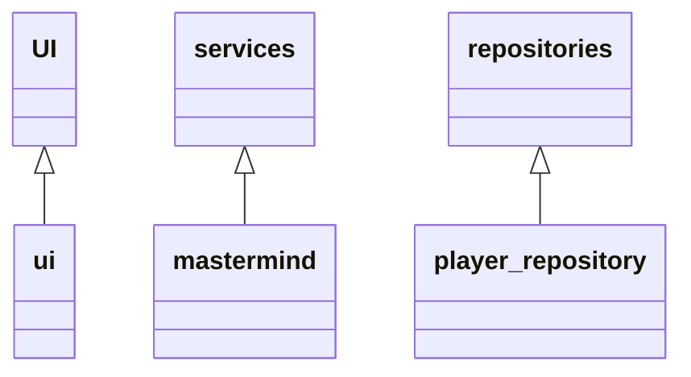

# Arkkitehtuurikuvaus
## Rakenne

Pakkauksessa ui on käyttöliittymästä vastaava koodi, pakkauksessa services sovelluslogiikasta ja pakkauksessa repositories tietojen pysyväistallennuksesta vastaava koodi. 