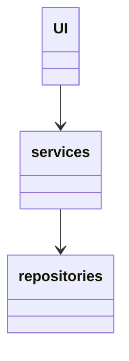

# Arkkitehtuurikuvaus
## Rakenne
Ohjelman rakenne noudattaa kolmitasoista arkkitehtuuria. Ohjelman pakkausrakenne on seuraavanlainen:

Pakkauksessa ui on käyttöliittymästä vastaava koodi, pakkauksessa services sovelluslogiikasta ja pakkauksessa repositories tietojen pysyväistalletuksesta vastaava koodi. 

## Käyttöliittymä
Käyttöliittymä sisältää kolme erilaista näkymää: alku-, loppu- ja varsinainen pelinäkymä. Ne on toteutettu omina luokkinaan. Näkymät näytetään UI-luokan avulla. Käyttöliittymää ei tässä vaiheessa ole täysin eristetty sovelluslogiikasta, mikä on selvästi puute. 

## Sovelluslogiikka

Sovelluslogiikasta vastaa luokka Mastermind, joka vastaa pelilogiikasta. Jonkin verran pelin kulkuun liittyvää toimintaa jäi kuitenkin myös käyttöliittymän koodiin, mutta jatkokehittelyssä nämä olisi tarkoitus eriyttää täysin toisistaan. Lisäksi services-luokassa on luokka PlayerService, joka vastaa tietokantaan talletettujen pelaajatietojen käsittelystä.

## Tietojen pysyväistallennus

Pakkauksessa repositories oleva PlayerRepository-luokka vastaa tietojen tallettamisesta. Luokka pyrkii noudattamaan Repository-suunnittelumallia eli on tarvittaessa korvattavissa muilla toteutuksilla. 

### Tiedostot
Sovellus tallettaa pelaajien tiedot SQL-tietokannan tauluun players. Taulu alustetaan initialize_database.py-tiedostossa. Sovelluksen juuressa sijaitseva kofiguraatiotiedosto .env määrittelee tiedoston nimen

## Päätoiminnallisuudet
### Pelin aloittaminen

### Pelaajan luominen pelaajalistalle

### Parhaiden pelaajien listaus

## Ohjelman rakenteeseen jääneet heikkoudet
### Käyttöliittymä
Jonkin verran sovelluslogiikasta vastaavaa koodia jäi käyttöliittymäluokkiin. Lisäksi käyttöliittymän metodeja voisi selkiyttää. 
### Tietojen tallennus
Pelaajista olisi voinut luoda oman luokkansa. Nyt tietokantaan talletetaan merkkijonona ja lukuja, mutta olisi voinut luoda olion, jolla on kyseiset ominaisuudet. Eli lisäksi entities-pakkaus, johon Player-luokka, ja sen olioita olisi talletettu PlayerRepositoryyn. 